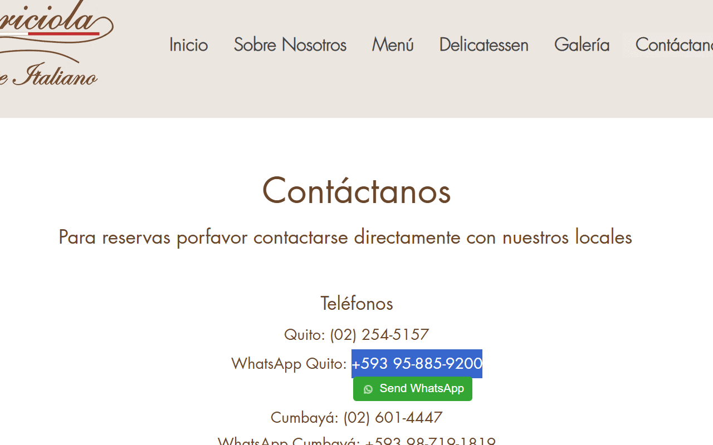
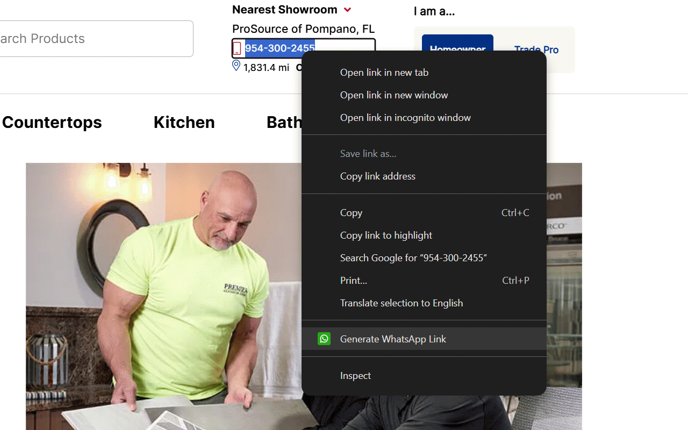
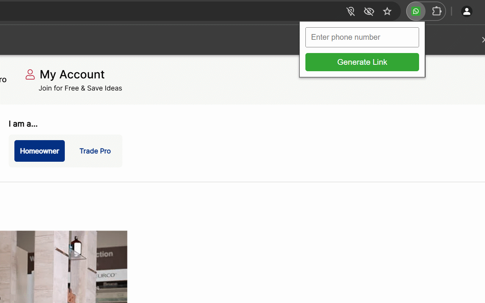

# WhatsApp Link Generator

**WhatsApp Link Generator** is a lightweight Chrome extension that allows you to generate WhatsApp chat links directly from your browser. Whether you select a phone number on any webpage or enter one manually through the popup form, the extension creates a properly formatted WhatsApp link (https://wa.me/phone_number) to instantly start a chat.

## Features

- **Context Menu Integration:**  
  Right-click a highlighted phone number to automatically generate a WhatsApp chat link and open it in a new tab.

- **Popup Form:**  
  Click the extension icon to open a small form where you can enter a phone number. The extension then generates and opens the WhatsApp link.

- **Smart Phone Number Extraction:**  
  The extension extracts only digits from any selected text, ensuring that the WhatsApp link is formatted correctly (a minimum of 10 digits is required).

- **Auto-closing Tab:**  
  After opening the WhatsApp chat in a new tab, the extension automatically closes the tab after a brief delay, keeping your workspace clutter-free.

## Screenshots

Below are some screenshots demonstrating the functionality of the extension:

- **Floating Button on Webpages:**  
  

- **Context Menu Usage:**  
  

- **Popup Form:**  
  

## Installation

1. Clone or download the repository.
2. Open Chrome and navigate to `chrome://extensions/`.
3. Enable **Developer mode** using the toggle in the top right corner.
4. Click on **Load unpacked** and select the repository folder.
5. The extension will be installed and ready to use.

## Usage

- **From Webpage:**  
  Highlight a phone number on any webpage, right-click, and choose "Generate WhatsApp Link". The extension will format the number, open a WhatsApp chat in a new tab, and then close the tab automatically after a few seconds.

- **From Popup Form:**  
  Click the extension icon, enter a phone number in the input field, and click the "Generate Link" button. A new tab will open with the WhatsApp chat, which will be auto-closed after a moment.

## Repository Structure

- `manifest.json`: Configuration file for the Chrome extension.
- `background.js`: Background scripts for context menu and tab management.
- `content.js`: Injects a floating button on webpages when a valid phone number is selected.
- `popup.html`: The HTML for the popup form displayed when clicking the extension icon.
- `popup.js`: Logic for generating the WhatsApp link from the popup form.
- **Screenshots:**  
  Image files (e.g., `popup.png`, `context-menu.png`, `floating-button.png`) that showcase the extension's functionality.

## Contributing

Contributions are welcome! Fork the repository, make your changes, and submit a pull request. For any issues, please create an issue on the GitHub repository.

## License

[MIT License](LICENSE)
